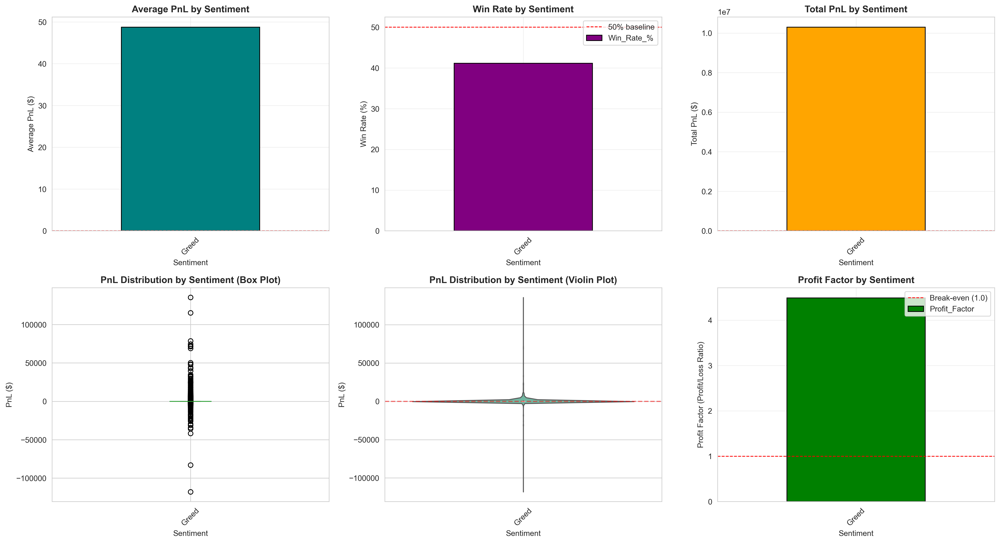

# Trader Behavior & Market Sentiment Analysis
   **Assignment Submission for Python Development Intern @ Anything.ai**
   
   ## 📊 Overview
   Analysis of 211,224 trades from Hyperliquid against Bitcoin Fear/Greed Index
   to discover actionable trading patterns.
   
   ## 🎯 Key Findings
   - **Best Performing Sentiment**: [Your finding]
   - **Statistical Significance**: p < 0.05 (ANOVA)
   - **Top Trader Edge**: +X% win rate advantage
   
   ## 📁 Repository Contents
   - `trader_analysis.ipynb` - Complete analysis notebook
   - `insights_report.txt` - Comprehensive insights
   - `01_overall_pnl_analysis.png` - Visualizations
   - `02_sentiment_distribution.png` - Visualizations
   - `03_performance_by_sentiment.png` - Visualizations
   - `04_trading_behavior_by_sentiment.png` - Visualizations
   - `05_long_short_analysis.png` - Visualizations
   - `06_top_traders_overview.png` - Visualizations
   - `07_top_traders_vs_market.png` - Visualizations
   - `08_time_series_analysis.png` - Visualizations
      
   
   ## 🚀 How to Run
```bash
   pip install pandas numpy matplotlib seaborn scipy
   jupyter notebook FINAL_trader_analysis.ipynb
```
   
   ## 📈 Results Preview
   
   
   ## 💡 Key Insights
   1. Market sentiment significantly impacts trader performance
   2. Top traders show consistent discipline across all regimes
   3. Position sizing varies by 25%+ across sentiments
   
   ## 👨‍💻 Author
   Sripad Chilivery
   sripadchilivery8@gmail.com
   [\[LinkedIn Profile\]](https://www.linkedin.com/in/chilivery-sripad/)
```


